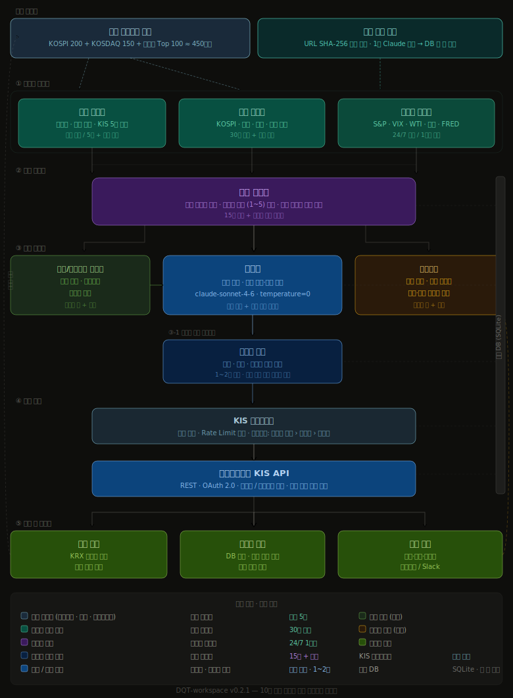

# DQT-workspace 시스템 기획서

> **Document Summary**
> Claude API와 한국투자증권 KIS API를 결합한 데일리 퀀트 자동매매 시스템의 기획 및 설계 문서.
> 감정 없이 규칙 기반으로 작동하는 알고리즘 트레이딩 시스템을 목표로 한다.

| 항목 | 내용 |
|------|------|
| 프로젝트명 | DQT-workspace (Dean Quant Trading) |
| 작성자 | Dean (jaja9dm) |
| 최초 작성일 | 2026-04-11 |
| 현재 버전 | v1.0.0 |
| 상태 | 모의투자 운용 중 |

---

## 버전 히스토리

| 버전 | 날짜 | 내용 |
|------|------|------|
| v1.0.0 | 2026-04-13 | 첫 실전 모의투자 가동 — 시스템 완성 및 첫 거래일 정상 운용 확인 |
| v0.2.6 | 2026-04-13 | 장중 시뮬레이션 추가 — `simulate_intraday.py` (Brownian Bridge, 실제 OHLCV 기반) |
| v0.2.5 | 2026-04-13 | 시뮬레이션 v2 — 일봉 MACD 필터 + 오프닝 게이트 판단 적용 |
| v0.2.4 | 2026-04-12 | 네트워크 복원력 — FDR 3회 재시도 + 체크포인트 기반 중단 재개 |
| v0.2.3 | 2026-04-12 | 트레일링 스톱 + 사다리 매수 전략 추가 — 포지션 감시 서브엔진 고도화 |
| v0.2.2 | 2026-04-12 | 알림 채널 변경 — 카카오톡/Slack → 텔레그램 Bot API |
| v0.2.1 | 2026-04-11 | 구조적 공백 보완 — KIS 게이트웨이, 감성 분석 캐시, 종목 유니버스, 포지션 감시 서브엔진 추가 (10개 엔진) |
| v0.2.0 | 2026-04-11 | 아키텍처 전면 재설계 — 멀티팀 멀티엔진 구조 (7개 팀), 팀별 역할·스케줄·I/O 명세 |
| v0.1.2 | 2026-04-11 | 핵심 철학 확장 — 이성적 손절, 기회비용, 큰 수의 법칙, 51 대 49 전략 철학 정의 |
| v0.1.1 | 2026-04-11 | 레이어별 상세 설계 정책 추가 — 입출력 명세, 임계값, 에러 처리 정의 |
| v0.1.0 | 2026-04-11 | 최초 기획 초안 작성 — 아키텍처, 전략, 기술스택 정의 |

---

## 1. 프로젝트 개요

### 목적
퀀트 투자란 **감이 아닌 숫자와 규칙으로 하는 투자**다.
본 시스템은 Claude API를 두뇌로, KIS API를 실행 엔진으로 사용하여
사람의 감정 개입 없이 매일 자동으로 매수/매도 판단을 내리는 시스템을 구축한다.

### 핵심 철학

**감정 배제**
공포에 팔고 탐욕에 사는 것은 인간의 본능이다. 본 시스템은 시장이 흔들려도 사전에 정의된 규칙만 실행한다. 감정이 개입할 여지를 구조적으로 차단한다.

**규칙 기반**
명확한 조건이 충족될 때만 거래한다. 애매한 상황에서는 홀드(hold)가 기본값이다. "지금 사야 할 것 같은 느낌"은 신호가 아니다.

**이성적 손절 — 기회비용의 최대화**
손절은 실패가 아니라 **자본을 더 나은 기회로 이동시키는 의사결정**이다.
손실 -5%에서 손절하면 원금 회복에 5.3%만 필요하지만, -30%까지 버티면 42.9%를 벌어야 원금이다.
묶인 자본은 다른 기회를 놓친다. 빠른 손절은 기회비용을 줄이는 가장 확실한 방법이다.

**큰 수의 법칙 — 51 대 49의 게임**
단 한 번의 거래로 승부를 보려 하지 않는다.
승률 51%, 손익비 1:1이어도 100번 거래하면 기대값은 플러스다.
핵심은 **한 번의 판단을 완벽하게 하는 것이 아니라, 올바른 확률 구조를 충분히 많이 반복하는 것**이다.
이를 위해 단일 거래의 크기를 제한하고, 시스템을 멈추지 않고 계속 작동시킨다.

**검증 우선**
실전 투자 전 반드시 모의투자 3개월 검증. 백테스트 수익률이 아닌 실제 슬리피지와 수수료가 반영된 결과로 판단한다.

**리스크 관리**
한 번에 전량 매수/매도하지 않는다. **분할 매수·분할 매도**로 평균 단가를 분산시키고, 타이밍 리스크를 줄인다.
일일 거래 횟수에 고정 상한은 없다. 조건이 충족되면 거래하고, 조건이 없으면 아무것도 하지 않는 것이 최선이다.
시장이 불확실하거나 신호가 약하면 현금을 보유하는 것도 하나의 포지션이다.
시스템이 살아있어야 큰 수의 법칙이 작동한다. 한 번의 큰 손실로 게임이 끝나면 안 된다.

### 투자 주기
**데일리 ~ 스윙 트레이딩** — 당일 청산을 목표로 하되, 조건이 충족되지 않으면 수일간 포지션을 유지한다.

분석과 모니터링은 장 전·장 중·장 후 구분 없이 상시 실행한다.
- **장 전 (08:00~09:00):** 뉴스·공시·지표 수집, Claude 분석, 주문 준비
- **장 중 (09:00~15:30):** 체결 확인, 손절·익절 조건 실시간 모니터링, 추가 신호 감지
- **장 후 (15:30~):** 체결 결과 저장, 포지션 평가, 익일 분석 데이터 준비

"오늘 안에 팔아야 한다"는 강제 조건은 없다. 신호가 없으면 기다리는 것이 포지션이다.

---

## 2. 시스템 아키텍처



```
                    ┌─────────────────────────────────┐
                    │   KIS 게이트웨이 (공통 인프라)     │
                    │  토큰 관리 · Rate Limit · 인증    │
                    └────────────────┬────────────────┘
                                     │ 모든 KIS API 호출 경유
┌────────────────────────────────────┼───────────────────────────────────┐
│                    데이터 수집부    │                                    │
│  ┌──────────────┐ ┌─────────────┐  │  ┌──────────────┐                 │
│  │ 국내 주식팀   │ │ 국내 시황팀  │  │  │ 글로벌 시황팀 │                 │
│  │ 장중 / 5분   │ │   / 30분   │  │  │ 24/7 / 1시간 │                 │
│  └──────┬───────┘ └──────┬──────┘  │  └──────┬───────┘                 │
│         └────────────────┴─────────┘─────────┘                         │
│                          ▼                                              │
│              ┌───────────────────────┐                                  │
│              │  감성 분석 캐시         │                                  │
│              │  뉴스 1회 수집 → Claude │                                  │
│              │  분석 → DB 저장·공유   │                                  │
│              └───────────┬───────────┘                                  │
└──────────────────────────┼──────────────────────────────────────────────┘
                           ▼
          ┌────────────────────────────────┐
          │          위기 관리팀             │
          │  15분 주기 + 이벤트 즉시 트리거   │
          │  리스크 레벨 (1~5) · 포지션 한도 │
          └──────────────┬─────────────────┘
            ┌────────────┼────────────────┐
            ▼            ▼                ▼
     ┌──────────┐ ┌────────────┐ ┌─────────────┐
     │  매매팀   │◄│   연구소   │ │  리포트팀    │
     │  장중 상시│ │ 장마감·주간│ │ 장마감·주간  │
     └────┬─────┘ └────────────┘ └──────┬──────┘
          │                             │
          ▼                             │ 피드백
  ┌───────────────┐                     │
  │ 포지션 감시    │────체결·손익────────►│
  │  1~2분 주기   │                     │
  └───────┬───────┘                     │
          │ 손절·익절 주문                │
          ▼                             │
  ┌───────────────┐                     │
  │ KIS 게이트웨이 │─── 체결 결과 ───────►│
  └───────────────┘               각 팀 공유
```

### 팀 구성 요약

| 팀 | 역할 한 줄 요약 | 엔진 타입 | 실행 주기 |
|----|-------------|---------|---------|
| **KIS 게이트웨이** | KIS API 토큰·호출 통합 관리 | 공통 인프라 | 상시 대기 |
| **감성 분석 캐시** | 뉴스 1회 수집·분석 후 DB 공유 | 공통 서비스 | 수집 시 즉시 |
| 국내 주식팀 | 오늘 돈이 몰리는 종목·섹터 포착 (체크포인트 재개) | 장중 엔진 | 09:00~15:30 / 5분 |
| 장중 MACD팀 | Hot List + 보유 포지션 분봉 MACD Pre-Cross 감지 | 장중 엔진 | 3분 |
| 국내 시황팀 | 코스피 거시 환경·수급 분석 | 주기적 엔진 | 30분 |
| 글로벌 시황팀 | 미국·원유·환율·VIX 모니터링 | 24/7 상시 엔진 | 1시간 |
| 위기 관리팀 | 전체 데이터 종합, 리스크 레벨 산출 | 주기적 + 트리거 | 15분 + 즉시 |
| 매매팀 | 5단계 게이트 → Claude 최종 판단 → KIS 주문 (오프닝 게이트 포함) | 장중 + 트리거 | 5분 |
| **포지션 감시** | 보유 종목 트레일링 스톱·익절·MACD 조기손절 감시 | 장중 상시 엔진 | 90초 |
| 로직/알고리즘 연구소 | 전략 연구·개선·백테스트 (주 1회 심층 백테스트) | 배치 엔진 | 16:00 / 일요일 16:30 |
| 리포트팀 | 전 팀 성과 집계·피드백 발송 | 배치 엔진 | 15:40 배치 |

---

## 3. 팀별 구성 및 역할

> 각 팀은 독립적인 엔진(프로세스)으로 실행되며, 공유 DB를 통해 정보를 주고받는다.
> Claude API는 각 팀의 판단이 필요한 순간마다 전문화된 프롬프트로 호출된다.

---

### 공통 인프라 0-1. KIS 게이트웨이

**엔진 타입:** 상시 대기 서비스 — 모든 팀이 KIS API를 직접 호출하지 않고 반드시 이 게이트웨이를 경유한다.

**한 줄 목표:** KIS API 토큰과 Rate Limit를 한 곳에서 관리하여 토큰 충돌·만료 장애를 원천 차단한다.

**핵심 기능**

| 기능 | 내용 |
|------|------|
| 토큰 관리 | Access Token 발급·갱신·만료 감지. 만료 30분 전 자동 갱신 |
| Rate Limit 관리 | KIS API 호출 횟수 제한 준수 (초당·분당 한도 큐잉) |
| 요청 라우팅 | 팀별 우선순위 설정 — 포지션 감시 > 매매팀 > 수집팀 |
| 장애 처리 | 연결 오류 시 3회 재시도 → 실패 시 전 팀 알림 + 거래 중지 |
| 모의/실전 전환 | `KIS_MODE=paper|live` 환경변수 1개로 전체 전환 |

```python
# 모든 팀의 KIS API 호출 방식
from kis_gateway import KISGateway

gateway = KISGateway()  # 싱글턴
data = gateway.get_price("005930")        # 현재가 조회
gateway.place_order("005930", "buy", 10)  # 주문 실행
```

---

### 공통 인프라 0-2. 감성 분석 캐시

**엔진 타입:** 이벤트 기반 — 뉴스·공시가 새로 수집될 때마다 즉시 실행

**한 줄 목표:** 같은 뉴스를 여러 팀이 각자 Claude에 보내는 낭비를 제거한다. 수집 즉시 1회만 분석하고 전 팀이 DB에서 읽는다.

**처리 흐름**

```
뉴스·공시 수집 (종목별, 시황용)
        ↓
감성 분석 캐시 서비스
  - DB에 동일 URL 존재 여부 확인 (중복 스킵)
  - Claude API 호출 (claude-haiku-4-5, temperature=0)
  - 결과를 sentiment_cache 테이블에 저장
        ↓
각 팀은 DB에서 읽기만 함
```

```sql
CREATE TABLE sentiment_cache (
  url_hash    TEXT PRIMARY KEY,   -- SHA-256(URL)
  ticker      TEXT,               -- 종목코드 (시황 뉴스는 NULL)
  category    TEXT,               -- stock | market | global
  score       REAL,               -- -1.0 ~ +1.0
  direction   TEXT,               -- positive | neutral | negative
  confidence  REAL,
  key_factors TEXT,               -- JSON array
  analyzed_at DATETIME DEFAULT CURRENT_TIMESTAMP,
  expires_at  DATETIME            -- 24시간 후 만료
);
```

---

### 공통 인프라 0-3. 종목 유니버스 관리

**엔진 타입:** 배치 — 매일 장 전 1회 갱신

**한 줄 목표:** 국내 주식팀이 스캔할 종목 범위를 사전에 정의하여 API 호출 폭발과 Claude 비용 낭비를 방지한다.

**유니버스 구성**

| 구성 | 종목 수 | 기준 |
|------|--------|------|
| KOSPI 200 | 200종목 | 시가총액 상위 — 유동성 보장 |
| KOSDAQ 150 | 150종목 | 코스닥 대표 — 성장주 포함 |
| 당일 거래대금 상위 | 최대 100종목 | 전일 거래대금 TOP 100 — 시장 관심 집중 종목 |
| 공시 발생 종목 | 당일 실시간 추가 | KIND RSS — 공시 직후 즉시 편입 |
| **총 유니버스** | **최대 ~450종목** | 중복 제거 후 |

**갱신 시점:** 장 전 유니버스 확정 → 이후 공시 발생 종목만 실시간 추가

```sql
CREATE TABLE universe (
  ticker      TEXT PRIMARY KEY,
  name        TEXT,
  market      TEXT,   -- KOSPI | KOSDAQ
  reason      TEXT,   -- kospi200 | kosdaq150 | volume_top | disclosure
  added_at    DATETIME DEFAULT CURRENT_TIMESTAMP,
  active_date DATE    -- 해당 날짜만 유효
);
```

---

### 팀 1-1. 국내 주식팀

**엔진 타입:** 장중 엔진 — 09:00~15:30 / 5분 주기 + 급등 즉시 트리거

**한 줄 목표:** "오늘 시장에서 돈이 어디로 몰리는가"를 실시간으로 파악한다.

**데이터 소스**

| 데이터 | 소스 | 이유 |
|--------|------|------|
| 실시간 현재가·거래량·거래대금 | **KIS API** (실시간 시세) | FinanceDataReader는 일봉 기준 — 장중 5분 스캔 불가 |
| 호가·체결 데이터 | **KIS API** (호가 조회) | 매수/매도 잔량, 체결 강도 파악 |
| 과거 OHLCV (60일) | **FinanceDataReader** | RSI·MACD·볼린저밴드 계산용 |
| 신규 공시 | **KIND RSS** (실시간) | 공시 발생 즉시 종목 트리거 |
| 뉴스 | **네이버금융** 크롤링 | 종목 감성 분석 입력 |

**스캔 대상:** 종목 유니버스 (0-3) 에서 당일 확정된 ~450종목만 스캔. 전 종목 무차별 스캔 금지.

**수집·분석 항목**
- 거래대금 상위 종목 (실시간 TOP 30) — KIS API
- 거래량 급증 종목 (20일 평균 대비 2배 이상) — KIS API + FinanceDataReader
- 등락률 상위 종목 (당일 +3% 이상) — KIS API
- 주도 섹터·테마 (동일 섹터 다수 종목 동반 상승 여부) — KIS API
- 52주 신고가 돌파 종목 — FinanceDataReader
- 신규 공시 발생 종목 — KIND RSS → 감성 분석 캐시(0-2) 경유
- 기술적 지표: RSI, MACD, 볼린저밴드, 거래량 비율 — FinanceDataReader + pandas-ta
- 뉴스 감성 점수 — **감성 분석 캐시(0-2) DB에서 읽기** (직접 Claude 호출 금지)

**출력 — 종목 후보 리스트 (Hot List)**
```json
{
  "timestamp": "2026-04-11T10:30:00",
  "hot_list": [
    {
      "ticker": "005930",
      "name": "삼성전자",
      "signal_type": "volume_spike",
      "volume_ratio": 3.2,
      "price_change_pct": 2.8,
      "rsi": 38,
      "sector": "반도체",
      "reason": "외국인 순매수 + 거래량 급증 + RSI 과매도 반등"
    }
  ],
  "leading_sector": "반도체",
  "market_momentum": "bullish"
}
```

**즉시 트리거 조건**
- 거래량이 평균 5배 초과 → 위기 관리팀·매매팀에 즉시 알림
- 동일 섹터 3종목 이상 동시 +5% 돌파 → 섹터 모멘텀 경보 발령
- 시가총액 상위 10종목 중 3개 이상 동시 급락 → 시장 이상 신호 발령

---

### 팀 1-2. 국내 시황팀

**엔진 타입:** 주기적 엔진 — 장 전 1회 / 장 중 30분 / 장 마감 후 1회

**한 줄 목표:** "오늘 시장 전체가 사도 되는 날인가, 말아야 하는 날인가"를 판단한다.

**데이터 소스**

| 데이터 | 소스 | 이유 |
|--------|------|------|
| KOSPI / KOSDAQ 지수 실시간 | **KIS API** (지수 시세) | 장중 30분 갱신 시 실시간 필요 |
| 외국인·기관·개인 수급 | **KIS API** (투자자별 매매동향) | 당일 실시간 수급 파악 |
| 프로그램 매매 동향 | **한국거래소(KRX)** 공식 API | KRX 집계 데이터 |
| 공매도 현황 | **KRX** 공매도 통계 | 일별 공매도 잔고 |
| 시장 전체 뉴스 | **네이버금융** 크롤링 | 시황 기사 감성 분석 |
| 과거 지수 데이터 | **FinanceDataReader** | 추세·이동평균 계산용 |

**수집·분석 항목**
- KOSPI / KOSDAQ 지수 등락률·거래대금
- 시장 폭: 상승 종목 수 vs 하락 종목 수 (Advance-Decline)
- 외국인·기관·개인 수급 (순매수/순매도 금액)
- 프로그램 매매 동향 (차익/비차익)
- 공매도 현황 (과열 여부)
- 시장 전체 뉴스 감성 분석 (Claude)

**출력 — 시황 리포트**
```json
{
  "timestamp": "2026-04-11T08:50:00",
  "market_score": 0.65,
  "market_direction": "bullish",
  "kospi_change_pct": 0.8,
  "foreign_net_buy_bn": 1200,
  "institutional_net_buy_bn": -300,
  "advancing_stocks": 580,
  "declining_stocks": 320,
  "ad_ratio": 1.81,
  "summary": "외국인 강한 순매수, 기관 소폭 매도. 시장 폭 양호. 매수 우호 환경."
}
```

---

### 팀 1-3. 글로벌 시황팀

**엔진 타입:** 24/7 상시 엔진 — 1시간 주기 / 미국 장 개장·마감 시 즉시 분석

**한 줄 목표:** 한국 장에 영향을 줄 해외 변수를 사전에 포착하여 선제적으로 대응한다.

**데이터 소스**

| 데이터 | 소스 | 이유 |
|--------|------|------|
| 미국 3대 지수 (S&P500, NASDAQ, Dow) | **yfinance** (Yahoo Finance API) | 무료, 실시간에 준하는 데이터 |
| VIX 공포지수 | **yfinance** (`^VIX`) | 실시간 변동성 지수 |
| WTI 원유, 금 | **yfinance** (`CL=F`, `GC=F`) | 원자재 선물 시세 |
| 환율 (USD/KRW, JPY/KRW 등) | **yfinance** (`KRW=X` 등) | FX 환율 |
| 미국 10년물 국채 금리 | **yfinance** (`^TNX`) | 금리 변동 모니터링 |
| 코스피200 야간 선물 | **KIS API** (야간 선물 시세) | 한국 관련 야간 선물 |
| 주요 미국 기술주 | **yfinance** (NVDA, AAPL, TSMC 등) | 반도체·기술주 선행 지표 |
| 미국 경제지표 일정 | **FRED API** / investing.com | FOMC, CPI, 고용지표 발표일 |
| 글로벌 금융 뉴스 | **네이버금융** + **Reuters RSS** | 글로벌 이슈 감성 분석 |

**수집·분석 항목**
- 미국 3대 지수: S&P 500, NASDAQ, Dow Jones
- 공포지수: VIX
- 원자재: WTI 원유, 금
- 환율: USD/KRW, JPY/KRW, EUR/KRW
- 미국 10년물 국채 금리
- 코스피200 야간 선물
- 주요 미국 기술주 (NVIDIA, Apple, TSMC 등)
- 미국 경제지표 발표 일정 (FOMC, CPI, PPI, 고용지표)

**출력 — 글로벌 시황 리포트**
```json
{
  "timestamp": "2026-04-11T07:00:00",
  "global_risk_score": 2,
  "us_market": {
    "sp500_change": 0.8,
    "nasdaq_change": 1.2,
    "direction": "bullish"
  },
  "vix": 18.5,
  "usd_krw": 1320,
  "wti_oil": 82.5,
  "us_10y_yield": 4.35,
  "korea_market_outlook": "positive",
  "key_events_today": ["미 연준 의장 발언 예정 (한국시간 23:30)"],
  "risk_summary": "전반적 안정. 연준 발언 전후 변동성 주의."
}
```

**즉시 트리거 조건**
- VIX ≥ 25 → 위기 관리팀 즉시 알림
- 미국 지수 ±2% 이상 → 위기 관리팀 즉시 알림
- USD/KRW ±1% 이상 → 위기 관리팀 즉시 알림
- 미국 경제지표 서프라이즈 발생 → 분석 즉시 재실행

---

### 팀 2. 위기 관리팀

**엔진 타입:** 주기적 + 이벤트 트리거 — 15분 주기 / 어느 팀에서든 알림 수신 시 즉시

**한 줄 목표:** 모든 데이터를 종합해 "지금 얼마나 위험한가"를 수치로 만들어 매매팀에 전달한다.

**데이터 소스**

| 데이터 | 소스 | 이유 |
|--------|------|------|
| 국내 주식팀 결과 | **공유 DB** `hot_list` 테이블 | 직접 수집 없음, DB 읽기 |
| 국내 시황팀 결과 | **공유 DB** `market_condition` 테이블 | 직접 수집 없음, DB 읽기 |
| 글로벌 시황팀 결과 | **공유 DB** `global_condition` 테이블 | 직접 수집 없음, DB 읽기 |
| 현재 포트폴리오 손익 | **KIS API** (잔고·손익 조회) | 당일 실시간 손실률 계산 |

**리스크 레벨 정의**

| 레벨 | 상태 | 포지션 한도 | 매매팀 행동 지침 |
|------|------|-----------|----------------|
| 1 — 안전 | 전반 안정 | 100% | 정상 매매 |
| 2 — 주의 | 일부 불안 요소 | 70% | 신중 매매, 손절 기준 강화 |
| 3 — 경계 | 복수 리스크 신호 | 40% | 신규 매수 최소화 |
| 4 — 위험 | 복수 위험 신호 동시 | 0% | 신규 매수 중단, 기존 포지션 유지 |
| 5 — 위기 | 시장 붕괴 신호 | 0% | 전체 청산 + 시스템 일시 중지 |

**리스크 레벨 산출 로직**

```
점수 = 0
  + 글로벌 리스크 점수 (0~3점)
  + VIX 구간 (18↓=0, 18~25=1, 25~30=2, 30↑=3)
  + 외국인 수급 (순매수=0, 순매도=1, 급격 순매도=2)
  + 국내 시황 점수 역산 (market_score < 0이면 +1~2)
  + 당일 포트폴리오 손실 구간 (0~2% = 0, 2~3% = 2, 3%↑ = 5)

레벨 1 = 점수 0~2
레벨 2 = 점수 3~4
레벨 3 = 점수 5~6
레벨 4 = 점수 7~8
레벨 5 = 점수 9↑ 또는 특정 조건 (VIX 40↑, 포트폴리오 -5%↑)
```

**출력 — 위기 관리 리포트**
```json
{
  "timestamp": "2026-04-11T10:15:00",
  "risk_level": 2,
  "risk_score": 3,
  "position_limit_pct": 70,
  "max_single_trade_pct": 7,
  "stop_loss_tighten": true,
  "active_alerts": ["VIX 상승 추세", "외국인 순매도 전환"],
  "recommended_action": "신중 매매. 손절 기준 -5% → -3% 강화.",
  "next_review_in_min": 15
}
```

---

### 팀 4-1. 포지션 감시 서브 엔진

**엔진 타입:** 장중 상시 엔진 — 09:00~15:30 / 1~2분 주기

**한 줄 목표:** 매매팀이 매수한 이후, 보유 포지션을 계속 지켜보며 손절·익절·타임컷 조건 도달 시 즉시 주문을 실행한다.

> 매매팀은 "새로운 신호 탐색"에 집중하고, 포지션 감시는 이 서브 엔진이 전담한다. 두 역할을 분리하지 않으면 매매팀이 신호 탐색과 포지션 감시를 동시에 처리하다가 타이밍을 놓친다.

**데이터 소스**

| 데이터 | 소스 | 이유 |
|--------|------|------|
| 현재 보유 포지션·평균 단가 | **KIS 게이트웨이** → 잔고 조회 | 실시간 보유 현황 |
| 보유 종목 현재가 | **KIS 게이트웨이** → 실시간 시세 | 손익률 계산 |
| 위기 관리팀 리스크 레벨 | **공유 DB** `risk_status` | 레벨 2 이상 시 손절 기준 강화 |

**감시 및 실행 조건**

```
매 1~2분마다 보유 전 종목 스캔:

  [트레일링 스톱] — 매수 시 자동 등록, 기본 손절 방식
    초기 손절선 = 매수가 × (1 - 5%)          ← TRAILING_INITIAL_STOP_PCT 기본값 5%
    수익 +10% 이상 시 손절선 상향 시작:
      손절선 = max(현재 손절선, 현재가 × (1 - 5%))
      손절선은 절대 내려가지 않음 (단방향 상승)
    현재가 ≤ 손절선 → 전량 시장가 매도

  [사다리 매수] — 트레일링 스톱 등록 포지션에만 적용
    현재가 ≤ 매수가 × (1 - 20%) 이고 미실행 시
    보유 수량 × 1배 추가 매수 (평단 낮추기)

  [분할 익절]
    - 1차: +5% 도달 → 보유 수량 1/3 매도
    - 2차: +10% 도달 → 보유 수량 1/3 매도
    - 잔여: 트레일링 스톱 또는 타임컷 도달까지 보유

  [타임컷]
    - 보유 5 영업일 초과 종목 → 전량 청산

  [긴급 전량 청산] (리스크 레벨 5)
    - 보유 전 종목 시장가 즉시 청산

  [고정 손절] (트레일링 스톱 미등록 포지션 한정)
    - 리스크 레벨 1~3: -5%  리스크 레벨 4~5: -1%
```

**트레일링 스톱 파라미터 (.env로 조정 가능)**

| 파라미터 | 기본값 | 설명 |
|---|---|---|
| TRAILING_INITIAL_STOP_PCT | **5%** | 초기 손절선 (매수가 대비) — 기본값 v0.2.3에서 10%→5% 조정 |
| TRAILING_TRIGGER_PCT | 10% | 손절선 상향 시작 수익률 |
| TRAILING_FLOOR_PCT | 5% | 트레일링 간격 (현재가 대비) |
| LADDER_TRIGGER_PCT | 20% | 사다리 매수 발동 하락률 |
| LADDER_QTY_RATIO | 1.0배 | 사다리 매수 수량 |

**출력**
- 주문 실행 결과 → 공유 DB `trades` 테이블
- 트레일링 스톱 상태 → 공유 DB `trailing_stop` 테이블 (90초 주기 갱신)
- 손절·익절·사다리 매수 발동 → 즉시 알림 발송 (텔레그램)
- 포지션 현황 스냅샷 → 공유 DB `position_snapshot` 테이블 (1~2분 주기 갱신)

---

### 팀 3. 로직/알고리즘 연구소

**엔진 타입:** 배치 엔진 — 매일 장 마감 후 / 매주 일요일 심층 분석

**한 줄 목표:** 매매팀이 쓰는 전략을 지속적으로 연구·검증·개선하여 시스템이 시장에 뒤처지지 않게 한다.

**데이터 소스**

| 데이터 | 소스 | 이유 |
|--------|------|------|
| 거래 이력 전체 | **공유 DB** `trades` 테이블 | 전략별 성과 분석 |
| 리포트팀 피드백 | **공유 DB** `report_feedback` 테이블 | 개선 우선순위 파악 |
| 과거 주가 데이터 (백테스트용) | **FinanceDataReader** | 6개월 이상 과거 데이터 |
| 기술적 지표 계산 | **pandas-ta** | 새 전략 백테스트 시 계산 |

**주요 업무**
- **일일 전략 검토:** 당일 신호 vs 실제 결과 비교. 임계값 조정 여부 판단
- **백테스트:** 파라미터 변경 시 과거 데이터로 검증 (최소 6개월)
- **전략 라이브러리 관리:** 전략별 승률·손익비·샤프지수 기록
- **퀀트 기법 연구:** 새로운 팩터·기술적 분석 기법 탐구

**전략 라이브러리 (예시)**

| 전략 ID | 전략명 | 핵심 조건 | 승률 | 상태 |
|--------|--------|----------|------|------|
| S001 | 감성+RSI 복합 | 감성 > 0.6 AND RSI < 40 | - | 활성 |
| S002 | 거래량 모멘텀 | 거래량 비율 ≥ 3.0 | - | 활성 |
| S003 | 고점 돌파 | 전일 고점 돌파 + 거래량 확인 | - | 테스트 중 |
| S004 | 섹터 모멘텀 | 주도 섹터 내 2위권 종목 추종 | - | 연구 중 |
| S005 | 볼린저밴드 수축 | 밴드 폭 축소 후 돌파 | - | 연구 중 |

**출력 — 전략 업데이트 리포트**
```json
{
  "date": "2026-04-11",
  "strategy_updates": [
    {
      "strategy_id": "S001",
      "change": "RSI 임계값 40 → 35로 하향",
      "reason": "30일 데이터 분석 결과 RSI 35↓에서 성공률 더 높음",
      "backtest_win_rate_before": 0.52,
      "backtest_win_rate_after": 0.58
    }
  ],
  "new_research": ["평균회귀 전략 (과매도 후 반등)"],
  "deprecated": []
}
```

---

### 팀 4. 매매팀

**엔진 타입:** 장중 상시 엔진 + 이벤트 트리거 — 09:00~15:30 / 신호 즉시 반응

**한 줄 목표:** 모든 팀의 정보를 종합하여 최종 매수·매도를 결정하고 KIS API로 실행한다.

**데이터 소스**

| 데이터 | 소스 | 이유 |
|--------|------|------|
| 위기 관리팀 리스크 레벨 | **공유 DB** `risk_status` 테이블 | 매매 허용 여부 판단 |
| 종목 후보 (Hot List) | **공유 DB** `hot_list` 테이블 | 매수 후보 선별 |
| 시황 방향 | **공유 DB** `market_condition` + `global_condition` | 시장 환경 확인 |
| 활성 전략 목록 | **공유 DB** `active_strategies` 테이블 | 어떤 조건으로 진입할지 |
| 현재 잔고·포지션 | **KIS API** (잔고 조회) | 보유 수량·평균 단가 실시간 확인 |
| 현재가·호가 | **KIS API** (실시간 시세) | 주문가 결정, 손절 조건 감시 |
| 주문 실행·취소 | **KIS API** (주문 API) | 실제 매수·매도 실행 |

**의사결정 순서 (게이트 구조)**

```
① 위기 관리팀 리스크 레벨 확인
   └─ 레벨 4·5 → 즉시 중단 (매수 불가)
   └─ 레벨 3 → 매수 최소화 모드로 진행

② 국내 시황팀 시장 방향 확인
   └─ market_score < -0.3 → 매수 보류

③ 글로벌 시황팀 글로벌 리스크 확인
   └─ global_risk_score ≥ 4 → 매수 보류

④ 국내 주식팀 Hot List에서 후보 종목 선별
   └─ 연구소 전략 조건 충족 여부 판단

⑤ 조건 충족 종목 → 분할 매수 계획 수립 후 실행
```

**분할 매수·매도 정책**

```
매수: 목표 수량을 3회 분할 진입
  1차: 신호 발생 즉시 — 목표 수량의 40%
  2차: 1차 체결 후 추가 확인 신호 시 — 목표 수량의 35%
  3차: 2차 체결 후 포지션 강화 시 — 목표 수량의 25%

매도 (분할 익절):
  1차 익절: +5% 도달 시 → 보유 수량의 1/3 청산
  2차 익절: +10% 도달 시 → 보유 수량의 1/3 청산
  잔여 보유: 손절 기준 또는 타임컷(5 영업일) 도달까지 보유

손절: -5% (리스크 레벨 2 이상 시 -3%) → 전량 시장가 즉시 청산
```

---

### 팀 5. 리포트팀

**엔진 타입:** 배치 엔진 — 매일 장 마감 후 / 매주 일요일 / 중요 이벤트 즉시

**한 줄 목표:** 각 팀이 얼마나 잘 작동했는지 측정하여 시스템 전체가 스스로 개선될 수 있는 피드백 루프를 만든다.

**데이터 소스**

| 데이터 | 소스 | 이유 |
|--------|------|------|
| 거래 이력 | **공유 DB** `trades` 테이블 | 당일 체결 결과 집계 |
| Hot List 이력 | **공유 DB** `hot_list` 테이블 | 놓친 종목 분석 |
| 시황·리스크 이력 | **공유 DB** 각 팀 테이블 | 팀별 판단 정확도 계산 |
| 전략 이력 | **공유 DB** `active_strategies` 테이블 | 전략 변경 전후 성과 비교 |
| 알림 발송 | **텔레그램 Bot API** | 리포트 발송 채널 |

**일일 리포트 항목**
- 당일 거래 요약 (종목·방향·수익률)
- 팀별 기여도: 어느 팀의 신호가 수익에 기여했는가
- 놓친 기회: Hot List에 있었지만 매매하지 않은 종목의 결과
- 위기 관리팀 리스크 레벨 이력 및 판단 정확성
- 누적 수익률 현황

**주간 리포트 항목**
- 전략별 승률·손익비·샤프지수
- 팀별 신호 정확도 추이
- 개선 제안 (연구소에 전달)
- 다음 주 시장 캘린더 (경제지표 발표, FOMC 등)

**각 팀에 전달하는 피드백**

| 수신 팀 | 피드백 내용 |
|--------|-----------|
| 국내 주식팀 | Hot List 종목 중 실제 수익 비율, 놓친 종목 분석 |
| 국내 시황팀 | 시장 방향 예측 정확도 (예측 vs 실제) |
| 글로벌 시황팀 | 글로벌 경보의 실효성, 과잉 반응 여부 |
| 위기 관리팀 | 리스크 레벨 판단 적절성 (과도/과소 반응) |
| 매매팀 | 전략별 수익률, 분할 진입 효과, 손절 타이밍 |
| 연구소 | 전략 변경 전후 성과 비교, 개선 우선순위 |

---

## 4. 기술 스택

| 분류 | 기술 | 용도 |
|------|------|------|
| 언어 | Python 3.11+ | 전체 시스템 |
| AI | Claude API (claude-sonnet-4) | 분석 / 판단 엔진 |
| 국내 실시간 데이터 | KIS API (시세·수급·잔고) | 장중 실시간 주가·거래량·포지션 |
| 국내 과거 데이터 | FinanceDataReader, pandas | 일봉 OHLCV, 재무 데이터, 지표 계산 |
| 해외 데이터 | yfinance (Yahoo Finance) | 미국 지수·VIX·환율·원자재 |
| 공시 | KIND RSS | 실시간 공시 수신 |
| 경제지표 일정 | FRED API | FOMC·CPI 등 발표 일정 |
| 지표 | pandas-ta | 기술적 지표 계산 |
| 거래 | KIS API (한국투자증권) | 실제 주문 실행 |
| DB | SQLite → 추후 PostgreSQL | 거래 이력 / 로그 저장 |
| 스케줄러 | APScheduler / cron | 매일 자동 실행 |
| 알림 | 텔레그램 Bot API | 결과 알림 |
| 버전관리 | Git / GitHub | 코드 및 문서 관리 |

---

## 5. 리스크 정책 (초안)

- 분할 매수·분할 매도: 단일 진입 금액은 전체 자산의 10% 이하
- 일일 거래 횟수: 고정 상한 없음 — 조건이 없으면 거래하지 않는다
- 일일 최대 손실 한도: 전체 자산의 3% → 자동 거래 중지
- 종목 집중도: 단일 종목 최대 비중 20%
- 실전 전환 조건: 모의투자 3개월 + 수익률 플러스 확인

---

## 6. 개발 단계 로드맵

| 단계 | 내용 | 상태 |
|------|------|------|
| Phase 0 | 프로젝트 구조 세팅, 문서화 | ✅ 완료 |
| Phase 1 | 데이터 수집 모듈 개발 | ⬜ 예정 |
| Phase 2 | Claude API 연동 및 분석 모듈 | ⬜ 예정 |
| Phase 3 | KIS API 모의투자 연동 | ⬜ 예정 |
| Phase 4 | 전략 로직 구현 및 백테스트 | ⬜ 예정 |
| Phase 5 | 스케줄러 + 알림 시스템 | ⬜ 예정 |
| Phase 6 | 3개월 모의투자 검증 | ⬜ 예정 |
| Phase 7 | 실전 투자 전환 | ⬜ 예정 |

---

## 8. 팀별 상세 설계 정책

> 각 팀의 스케줄, 트리거, Claude API 사용 전략, 팀 간 데이터 전달 구조를 정의한다.
> 모든 수치는 모의투자 결과를 기반으로 조정 가능하다.

---

### 8-1. 팀 간 데이터 전달 구조

각 팀은 공유 DB의 전용 테이블에 결과를 기록하고, 다른 팀은 이를 읽어 활용한다.
직접 API 호출이 아닌 **DB 기반 비동기 통신**으로 팀 간 결합도를 낮춘다.

```sql
-- 국내 주식팀 출력
CREATE TABLE hot_list (
  id INTEGER PRIMARY KEY,
  ticker TEXT, name TEXT, signal_type TEXT,
  volume_ratio REAL, price_change_pct REAL,
  rsi REAL, sector TEXT, reason TEXT,
  created_at DATETIME DEFAULT CURRENT_TIMESTAMP
);

-- 국내 시황팀 출력
CREATE TABLE market_condition (
  id INTEGER PRIMARY KEY,
  market_score REAL, market_direction TEXT,
  foreign_net_buy_bn REAL, institutional_net_buy_bn REAL,
  advancing_stocks INTEGER, declining_stocks INTEGER,
  summary TEXT, created_at DATETIME DEFAULT CURRENT_TIMESTAMP
);

-- 글로벌 시황팀 출력
CREATE TABLE global_condition (
  id INTEGER PRIMARY KEY,
  global_risk_score INTEGER, vix REAL,
  sp500_change REAL, nasdaq_change REAL,
  usd_krw REAL, wti_oil REAL, us_10y_yield REAL,
  korea_market_outlook TEXT, key_events TEXT,
  created_at DATETIME DEFAULT CURRENT_TIMESTAMP
);

-- 위기 관리팀 출력
CREATE TABLE risk_status (
  id INTEGER PRIMARY KEY,
  risk_level INTEGER, risk_score INTEGER,
  position_limit_pct INTEGER, max_single_trade_pct REAL,
  stop_loss_tighten BOOLEAN, active_alerts TEXT,
  recommended_action TEXT, created_at DATETIME DEFAULT CURRENT_TIMESTAMP
);

-- 연구소 출력 (현재 활성 전략)
CREATE TABLE active_strategies (
  strategy_id TEXT PRIMARY KEY,
  name TEXT, conditions TEXT,
  win_rate REAL, profit_factor REAL,
  parameters TEXT, status TEXT,
  updated_at DATETIME DEFAULT CURRENT_TIMESTAMP
);

-- 감성 분석 캐시 (0-2)
CREATE TABLE sentiment_cache (
  url_hash    TEXT PRIMARY KEY,
  ticker      TEXT,
  category    TEXT,   -- stock | market | global
  score       REAL,
  direction   TEXT,
  confidence  REAL,
  key_factors TEXT,   -- JSON array
  analyzed_at DATETIME DEFAULT CURRENT_TIMESTAMP,
  expires_at  DATETIME
);

-- 종목 유니버스 (0-3)
CREATE TABLE universe (
  ticker      TEXT PRIMARY KEY,
  name        TEXT,
  market      TEXT,   -- KOSPI | KOSDAQ
  reason      TEXT,   -- kospi200 | kosdaq150 | volume_top | disclosure
  added_at    DATETIME DEFAULT CURRENT_TIMESTAMP,
  active_date DATE
);

-- 포지션 스냅샷 (포지션 감시 팀 기록)
CREATE TABLE position_snapshot (
  id           INTEGER PRIMARY KEY,
  ticker       TEXT NOT NULL,
  quantity     INTEGER NOT NULL,
  avg_price    REAL NOT NULL,
  current_price REAL NOT NULL,
  pnl_pct      REAL NOT NULL,
  held_days    INTEGER NOT NULL,
  snapshot_at  DATETIME DEFAULT CURRENT_TIMESTAMP
);

-- 거래 이력 (매매팀 기록, 리포트팀 읽기)
CREATE TABLE trades (
  id INTEGER PRIMARY KEY,
  date DATE, ticker TEXT, action TEXT,
  order_price REAL, exec_price REAL, quantity INTEGER,
  tranche INTEGER,  -- 분할 몇 번째인지 (1/2/3)
  status TEXT, pnl REAL, pnl_pct REAL,
  signal_source TEXT, strategy_id TEXT,
  created_at DATETIME DEFAULT CURRENT_TIMESTAMP
);
```

---

### 8-2. 팀별 스케줄 및 트리거 명세

#### KIS 게이트웨이

| 구분 | 내용 |
|------|------|
| 기동 시점 | 시스템 시작 시 가장 먼저 기동 |
| 토큰 갱신 | 만료 30분 전 자동 갱신 (매일 장 전 포함) |
| 우선순위 큐 | 포지션 감시 > 매매팀 > 수집팀 순으로 처리 |
| 모드 전환 | `KIS_MODE` 환경변수로 paper/live 전환 |

#### 감성 분석 캐시

| 구분 | 내용 |
|------|------|
| 실행 방식 | 뉴스·공시 수집 즉시 트리거 (큐 방식) |
| 중복 처리 | URL 해시로 이미 분석된 뉴스 스킵 |
| 캐시 만료 | 24시간 후 자동 만료 |
| Claude 모델 | claude-haiku-4-5 (속도·비용 최적화) |

#### 종목 유니버스

| 구분 | 내용 |
|------|------|
| 기본 갱신 | 매일 장 전 1회 (KOSPI 200 + KOSDAQ 150 + 거래대금 상위 100) |
| 실시간 추가 | KIND 공시 발생 종목 즉시 편입 |
| 만료 | 당일 장 마감 후 폐기, 익일 재생성 |

#### 포지션 감시

| 구분 | 내용 |
|------|------|
| 정규 실행 | 09:00~15:30 / 1~2분마다 전 보유 종목 스캔 |
| 즉시 트리거 | 리스크 레벨 변경 시 손절 기준 즉시 재조정 |
| 즉시 트리거 | 리스크 레벨 5 → 전량 시장가 청산 |
| 종료 | 장 마감 후 당일 포지션 정리 완료 시 |

#### 국내 주식팀

| 구분 | 내용 |
|------|------|
| 정규 실행 | 09:00~15:30, 5분마다 전 종목 스캔 |
| 즉시 트리거 | 거래량 5배 초과 종목 감지 시 |
| 즉시 트리거 | 동일 섹터 3종목 동시 +5% 돌파 시 |
| 실행 중단 | 장 마감(15:30) 또는 위기 레벨 5 시 |
| 데이터 소스 | KIS API 실시간 호가, FinanceDataReader, KIND RSS |

#### 국내 시황팀

| 구분 | 내용 |
|------|------|
| 장 전 | 08:30 1회 (전일 마감 데이터 + 장 전 분위기) |
| 장 중 | 30분마다 갱신 |
| 장 마감 후 | 15:40 1회 (당일 최종 수급 정리) |
| 즉시 트리거 | 외국인 순매수 급변 (±1,000억 이상 30분 내) |

#### 글로벌 시황팀

| 구분 | 내용 |
|------|------|
| 정규 실행 | 24시간 / 1시간마다 |
| 즉시 트리거 | VIX ≥ 25, 미국 지수 ±2%, USD/KRW ±1% |
| 즉시 트리거 | 미국 주요 경제지표 발표 직후 (FOMC, CPI 등) |
| 한국 장 전 특별 실행 | 08:00 — 미국 장 마감 결과 종합 분석 |

#### 위기 관리팀

| 구분 | 내용 |
|------|------|
| 정규 실행 | 장 중 15분마다 |
| 즉시 트리거 | 어느 데이터 팀에서도 경보 수신 시 |
| 즉시 트리거 | 포트폴리오 당일 손실 -2% 초과 시 |
| 실행 환경 | 장 전·중·후 모두 작동 (글로벌 경보 처리 위해) |

#### 매매팀

| 구분 | 내용 |
|------|------|
| 정규 실행 | 09:00~15:30 상시 대기 |
| 즉시 트리거 | Hot List 갱신 시 자동 검토 |
| 즉시 트리거 | 보유 종목 손절·익절 조건 도달 시 |
| 주문 후 처리 | 30분 이내 미체결 → 시장가 전환 or 취소 |
| 실행 중단 조건 | 리스크 레벨 4↑, KIS API 오류, Claude API 실패율 50%↑ |

#### 로직/알고리즘 연구소

| 구분 | 내용 |
|------|------|
| 일일 배치 | 장 마감 후 (16:00~) |
| 주간 배치 | 일요일 심층 분석 (전주 전체 데이터 기반) |
| 출력 | active_strategies 테이블 업데이트 |

#### 리포트팀

| 구분 | 내용 |
|------|------|
| 일일 배치 | 장 마감 후 (17:00~) |
| 주간 배치 | 일요일 (주간 성과 종합) |
| 즉시 알림 | 리스크 레벨 4↑ 또는 일일 손실 -3%↑ 시 긴급 알림 |
| 발송 채널 | 텔레그램 채널 |

---

### 8-3. Claude API 사용 전략 (팀별)

| 팀 | 모델 | temperature | 호출 시점 | 역할 |
|----|------|-------------|---------|------|
| 국내 주식팀 | claude-haiku-4-5 | 0 | 5분 주기 (빠른 스캔) | 뉴스·공시 감성 점수화, Hot List 종목 요약 |
| 국내 시황팀 | claude-sonnet-4-6 | 0 | 30분 주기 | 시황 텍스트 종합 분석, 시장 방향 판단 |
| 글로벌 시황팀 | claude-sonnet-4-6 | 0 | 1시간 주기 | 글로벌 뉴스 감성, 한국 시장 영향도 판단 |
| 위기 관리팀 | claude-sonnet-4-6 | 0 | 15분 주기 + 트리거 | 복합 데이터 종합, 리스크 레벨 결정 |
| 매매팀 | claude-sonnet-4-6 | 0 | 신호 발생 시 | 최종 매매 판단, 수량 결정 |
| 연구소 | claude-opus-4-6 | 0.2 | 일일·주간 배치 | 전략 분석, 백테스트 해석, 개선안 도출 |
| 리포트팀 | claude-sonnet-4-6 | 0.3 | 일일·주간 배치 | 성과 리포트 생성, 인사이트 요약 |

> **temperature 0.2~0.3 허용 팀:** 연구소와 리포트팀은 창의적 인사이트 도출이 필요하므로 소폭 허용.
> 매매 판단 관련 팀은 반드시 0 (결정론적).

---

### 8-4. Circuit Breaker — 시스템 전체 자동 중지 조건

```
단계 1 — 매수 중단 (매도·손절은 계속)
  - 당일 포트폴리오 손실 ≥ -3%
  - 리스크 레벨 = 4
  - KIS API 연결 오류 지속 (5분 이상)

단계 2 — 전체 주문 중지 (기존 포지션 보유 유지)
  - 당일 포트폴리오 손실 ≥ -5%
  - Claude API 실패율 ≥ 50%

단계 3 — 전체 청산 + 시스템 일시 중지
  - 리스크 레벨 = 5
  - VIX ≥ 40
  - 연속 손실 ≥ 5 영업일
  → 수동 검토 후 재가동 필요
```

---

### 8-5. 에러 핸들링 정책

| 에러 유형 | 처리 방식 | 알림 |
|----------|----------|------|
| 네트워크 오류 | 3회 재시도 (5s → 15s → 30s) | 3회 실패 시 텔레그램 |
| KIS API 오류 | 주문 취소 + 로그 저장 | 즉시 텔레그램 |
| Claude API 오류 | 해당 팀 skip, 이전 결과 유지 | 실패율 30%↑ 시 텔레그램 |
| DB 쓰기 오류 | 로컬 CSV 백업 | 즉시 텔레그램 |
| 토큰 만료 | 자동 재발급 시도 | 재발급 실패 시 거래 중지 |
| 팀 프로세스 크래시 | 자동 재시작 (최대 3회) | 즉시 텔레그램 |
| 예상 외 예외 | 전체 프로세스 중지 + 스택트레이스 저장 | 즉시 텔레그램 |

---

### Layer 1 — 데이터 수집 정책 (구버전 참고용)

**실행 방식:** 상시 수집. 장 전에 집중적으로 수집하고, 장 중에는 주기적으로 갱신한다.

#### 1-1. 뉴스 / 공시 수집

| 항목 | 정의 |
|------|------|
| 소스 | 네이버금융 뉴스, KIND 공시시스템 |
| 수집 범위 | 최근 24시간 이내 기사 |
| 종목당 최대 건수 | 10건 (최신순 정렬) |
| 중복 제거 기준 | URL 해시 (SHA-256) → DB 비교 후 신규만 처리 |
| 수집 실패 처리 | 3회 재시도 (backoff: 5s → 15s → 30s) → 실패 시 스킵 + 텔레그램 알림 |
| 저장 형식 | `{ ticker, title, url, published_at, raw_text }` |

#### 1-2. 주가 / 재무 데이터 수집

| 항목 | 정의 |
|------|------|
| 주가 데이터 기간 | 최근 60 영업일 OHLCV (기술적 지표 계산에 충분한 범위) |
| 재무 데이터 갱신 주기 | 분기별 (공시 후 갱신) |
| 수집 팩터 | 종가, 거래량, PER, PBR, ROE, EPS, 부채비율 |
| 결측치 처리 | 직전 영업일 값으로 전진 채움 (forward fill) |
| 이상치 기준 | 전일 대비 ±30% 초과 → 경고 로그 + 수동 확인 대기 |

#### 1-3. 기술적 지표 계산 명세

| 지표 | 계산식 | 파라미터 | 판단 기준 |
|------|--------|---------|----------|
| RSI | RS = 평균상승 / 평균하락, RSI = 100 - (100 / 1+RS) | 기간: 14일 | ≤ 30 과매도, ≥ 70 과매수 |
| MACD | EMA(12) - EMA(26), Signal = EMA(9) | 12/26/9 | MACD > Signal = 상승 모멘텀 |
| 볼린저밴드 | 중심선: MA(20), 상단: MA+2σ, 하단: MA-2σ | 기간: 20일 | 하단 터치 = 매수 고려, 상단 터치 = 매도 고려 |
| 거래량 비율 | 당일 거래량 / 20일 평균 거래량 | 기간: 20일 | ≥ 2.0 = 급등 신호, ≥ 3.0 = 강한 모멘텀 |

#### 1-4. 시장 분위기 지표

| 지표 | 소스 | 정의 | 임계값 |
|------|------|------|--------|
| VIX (공포지수) | CBOE / Yahoo Finance | 시장 전반 불안도 | ≥ 30 = 고위험, 매수 규모 50% 축소 |
| 외국인 순매수 | 한국거래소 | 코스피 전일 외국인 순매수 금액 | ≥ +500억 = 긍정, ≤ -500억 = 부정 |
| 코스피 등락률 | FinanceDataReader | 전일 종가 대비 등락률 | ≤ -2% = 시장 조정 신호 |

---

### Layer 2 — Claude API 분석 정책

**실행 방식:** 데이터 수집 후 신호 감지 시 수시 실행. 장 전 전체 종목 분석 + 장 중 변화 감지 시 재분석.

#### 2-1. API 호출 설정

| 항목 | 값 |
|------|----|
| 모델 | claude-sonnet-4-6 |
| temperature | 0 (결정론적 출력 — 매매 판단은 일관성이 필수) |
| max_tokens | 1,024 |
| 응답 형식 | JSON (structured output) |
| 타임아웃 | 30초 |
| 재시도 | 2회 (실패 시 해당 종목 홀드 처리) |
| 일일 최대 호출 수 | 100회 (비용 관리 — 초과 시 우선순위 종목만 분석) |

#### 2-2. 뉴스 감성 분석 (API Call A)

**목적:** 비정형 뉴스 텍스트를 정량적 감성 점수로 변환

**입력 스키마:**
```json
{
  "ticker": "005930",
  "company_name": "삼성전자",
  "news_items": [
    { "title": "...", "body": "...", "published_at": "2026-04-11T07:30:00" }
  ]
}
```

**출력 스키마:**
```json
{
  "ticker": "005930",
  "sentiment_score": 0.75,
  "direction": "positive",
  "confidence": 0.85,
  "key_factors": ["반도체 수출 호조", "AI 수요 증가"],
  "risk_keywords": [],
  "reason": "..."
}
```

**감성 점수 정의:**

| 범위 | 방향 | 의미 |
|------|------|------|
| +0.7 ~ +1.0 | 강한 긍정 | 매수 신호로 적극 활용 |
| +0.3 ~ +0.7 | 긍정 | 다른 지표와 복합 판단 |
| -0.3 ~ +0.3 | 중립 | 뉴스 요인 무시, 기술적 지표만 활용 |
| -0.7 ~ -0.3 | 부정 | 매수 보류, 기존 포지션 점검 |
| -1.0 ~ -0.7 | 강한 부정 | 매도 신호로 적극 활용 |

#### 2-3. 종목 매매 판단 (API Call B)

**목적:** 수집된 모든 지표를 종합하여 최종 매매 액션 결정

**입력 스키마:**
```json
{
  "ticker": "005930",
  "price_data": { "close": 75000, "volume_ratio": 1.8 },
  "technical": { "rsi": 38, "macd_signal": "bullish", "bb_position": "lower" },
  "sentiment_score": 0.75,
  "market_condition": { "vix": 18, "foreign_net_buy": 800 },
  "current_position": { "held": false, "quantity": 0 }
}
```

**출력 스키마:**
```json
{
  "action": "buy",
  "ticker": "005930",
  "reason": "RSI 과매도 + 긍정 뉴스 감성 + 외국인 순매수 — 3가지 조건 충족",
  "confidence": 0.82,
  "suggested_quantity": 10,
  "price_target": 82000,
  "stop_loss": 71250
}
```

**action 정의:**

| action | 조건 | 우선순위 |
|--------|------|---------|
| `buy` | 매수 조건 충족 + 리스크 통과 | 1 |
| `sell` | 매도 조건 충족 (청산) | 1 |
| `hold` | 조건 불충분 또는 불확실 | 2 |
| `skip` | 데이터 부족, API 오류 등 | 3 |

#### 2-4. 리스크 체크 (API Call C)

**목적:** 매매 신호가 생성되더라도 포트폴리오 전체 관점에서 최종 승인 여부 결정

**입력 스키마:**
```json
{
  "proposed_action": "buy",
  "ticker": "005930",
  "quantity": 10,
  "current_portfolio": {
    "total_value": 10000000,
    "cash": 4000000,
    "positions": [{ "ticker": "000660", "value": 2000000 }],
    "daily_loss_pct": -0.5
  },
  "market_vix": 18
}
```

**출력 스키마:**
```json
{
  "approved": true,
  "adjusted_quantity": 8,
  "reason": "주문 금액이 포트폴리오 10% 한도를 초과하여 수량 조정",
  "risk_flags": []
}
```

---

### Layer 3 — 전략 판단 정책

**실행 방식:** Claude 분석 완료 즉시 실행. 장 중 실시간 신호도 동일한 로직으로 처리.

#### 3-1. 매수 진입 조건 (AND 조건 — 모두 충족 시 매수)

| 번호 | 조건 | 임계값 | 근거 |
|------|------|--------|------|
| A | 감성 점수 | ≥ +0.6 | 뉴스가 명확히 긍정적 |
| B | RSI | ≤ 40 | 과매도 구간 — 반등 기대 |
| C | MACD | MACD > Signal (골든크로스) | 상승 모멘텀 발생 |
| D | 거래량 비율 | ≥ 1.2 | 평균 이상 거래 — 관심 증가 |
| E | VIX | ≤ 30 | 시장 공포 과열 구간 아님 |

> **예외:** A 조건이 +0.9 이상이고 B~D 중 2가지 이상 충족 시 C 조건 면제 가능

#### 3-2. 매도 청산 조건 (OR 조건 — 하나라도 충족 시 매도)

| 번호 | 조건 | 임계값 | 분류 |
|------|------|--------|------|
| S1 | 감성 점수 | ≤ -0.6 AND RSI ≥ 70 | 복합 매도 신호 |
| S2 | 손실률 | ≤ -5% (매수가 대비) | 손절 (Stop Loss) |
| S3 | 수익률 | ≥ +10% (매수가 대비) | 익절 (Take Profit) |
| S4 | 보유 기간 | ≥ 5 영업일 | 타임 컷 (기회비용 관리) |
| S5 | VIX | ≥ 35 | 시장 위기 — 전면 청산 |

#### 3-3. 수량 결정 로직

```
주문 금액 = min(가용 현금 × 0.2, 포트폴리오 총액 × 0.1)
주문 수량 = floor(주문 금액 / 현재 주가)
```

- 최소 주문 수량: 1주
- 최대 단일 종목 비중: 포트폴리오의 20%
- 동시 매수 가능 종목 수: 최대 5종목

#### 3-4. 리스크 필터 (최종 게이트)

아래 조건 중 하나라도 해당하면 **당일 모든 주문 차단:**

- 당일 누적 손실 ≥ 포트폴리오의 3%
- VIX ≥ 40 (극단적 시장 공포)
- KIS API 연결 오류 발생
- Claude API 응답 실패율 ≥ 50% (데이터 신뢰 불가)

---

### Layer 4 — 주문 실행 정책

**실행 방식:** 신호 발생 즉시 실행. 장 중 언제든 조건이 충족되면 주문한다.

#### 4-1. 주문 방식 정의

| 상황 | 주문 방식 | 가격 설정 |
|------|----------|----------|
| 기본 매수 | 지정가 | 현재가 × 1.003 (호가 스프레드 고려) |
| 기본 매도 | 지정가 | 현재가 × 0.997 |
| 미체결 전환 | 시장가 | 주문 후 30분 이내 미체결 시 시장가로 변경 |
| 손절 매도 | 시장가 | 즉시 체결 우선 |

#### 4-2. KIS API 인증 정책

| 항목 | 정의 |
|------|------|
| 인증 방식 | OAuth 2.0 (Access Token) |
| 토큰 유효기간 | 24시간 |
| 토큰 갱신 시점 | 매일 장 전 (수집 시작 전 갱신) |
| 토큰 만료 처리 | 자동 재발급 → 실패 시 거래 전면 중지 + 알림 |
| 모의/실전 전환 | 환경변수 `KIS_MODE=paper|live` 로 제어 |

#### 4-3. Circuit Breaker (자동 거래 중지 조건)

```
IF 일일 손실 ≥ 3%   → 당일 신규 매수 전면 중지
IF 일일 손실 ≥ 5%   → 당일 전체 주문 중지 + 기존 포지션 유지
IF 연속 손실 ≥ 5일  → 시스템 자동 중지 + 수동 검토 요청 알림
```

---

### Layer 5 — 피드백 정책

**실행 방식:** 체결 즉시 실시간 기록 + 장 마감 후 일일 정리 및 리포트 발송.

#### 5-1. DB 저장 스키마 (거래 이력)

```sql
CREATE TABLE trades (
  id           INTEGER PRIMARY KEY,
  date         DATE NOT NULL,
  ticker       TEXT NOT NULL,
  action       TEXT NOT NULL,     -- buy / sell
  order_price  REAL NOT NULL,
  exec_price   REAL,              -- 체결가 (미체결 시 NULL)
  quantity     INTEGER NOT NULL,
  status       TEXT NOT NULL,     -- filled / unfilled / partial
  pnl          REAL,              -- 손익 (매도 시 계산)
  pnl_pct      REAL,
  signal_score REAL,              -- Claude 감성 점수
  strategy     TEXT,              -- 적용된 전략 ID
  created_at   DATETIME DEFAULT CURRENT_TIMESTAMP
);
```

#### 5-2. 일일 리포트 항목

| 항목 | 내용 |
|------|------|
| 당일 수익률 | 전일 포트폴리오 대비 당일 평가액 등락률 |
| 전략별 성과 | 각 매수/매도 신호의 근거 전략 ID + 결과 |
| 미체결 건수 | 주문 전송 후 미체결된 종목 리스트 |
| Claude 판단 정확도 | 매수 후 익일 수익률 플러스 비율 (롤링 30일) |
| 누적 수익률 | 시스템 시작일 대비 현재 수익률 |

#### 5-3. 알림 발송 정책

| 이벤트 | 발송 시점 | 내용 |
|--------|----------|------|
| 주문 전송 | 신호 발생 즉시 | 종목, 수량, 주문가, 방향 |
| 체결 완료 | 체결 즉시 | 체결가, 체결 수량 |
| 미체결 경고 | 주문 후 30분 | 미체결 종목 리스트 |
| 손절 발동 | 손절 즉시 | 종목, 손실률, 사유 |
| 일일 리포트 | 장 마감 후 | 당일 수익률 + 포트폴리오 요약 |
| 에러 발생 | 즉시 | 에러 내용 + 영향 범위 |

---

### Layer 6 — 스케줄러 정책

**구현 방식:** APScheduler (Python) 또는 cron

#### 6-1. 실행 구조

고정 시간 스케줄이 아닌 **이벤트 기반 + 주기 모니터링** 혼합 구조로 운영한다.

```
[장 전]
  - KIS API 토큰 갱신
  - 전체 종목 데이터 수집 (뉴스, 주가, 지표, 시장 분위기)
  - Claude API 일괄 분석 (감성, 매매 판단, 리스크)
  - 장 시작 전 주문 리스트 확정

[장 중 — 상시 루프]
  - N분 주기로 주가·지표 갱신 및 신호 재점검
  - 신규 뉴스·공시 감지 시 해당 종목 즉시 재분석
  - 신호 발생 즉시 주문 실행
  - 주문 후 30분 이내 미체결 시 시장가 전환 or 취소
  - 손절·익절 조건 실시간 감시

[장 마감 후]
  - 체결 결과 최종 수집 + DB 저장
  - 일일 리포트 생성 + 알림 발송
  - 익일 분석 데이터 사전 준비
```

#### 6-2. 휴장일 처리

- KRX 영업일 여부 확인: `FinanceDataReader`의 거래일 캘린더 활용
- 주말 / 공휴일 / 임시 휴장일: 08:00 수집 단계에서 휴장 감지 → 이후 전 단계 스킵
- 조기 폐장일: 주문 시간 자동 조정 (15:00 이전 마감 처리)

---

### Layer 7 — 에러 핸들링 정책

| 에러 유형 | 처리 방식 | 알림 |
|----------|----------|------|
| 네트워크 오류 | 3회 재시도 (exponential backoff) | 3회 모두 실패 시 텔레그램 |
| Claude API 오류 | 해당 종목 `skip` 처리 | 실패율 50% 초과 시 전체 중지 |
| KIS API 주문 오류 | 주문 취소 + 로그 저장 | 즉시 텔레그램 |
| DB 쓰기 오류 | 로컬 CSV 백업 파일에 임시 저장 | 즉시 텔레그램 |
| 토큰 만료 | 자동 재발급 시도 | 재발급 실패 시 거래 중지 |
| 예상 외 예외 | 전체 프로세스 중지 + 스택트레이스 저장 | 즉시 텔레그램 |

---

## 7. 미결정 사항

- [ ] 초기 투자 금액 규모
- [ ] 주요 타깃 종목군 (코스피 전체 vs 특정 섹터)
- [ ] 모의투자 기간 (최소 3개월 권장)
- [ ] 알림 채널 선택 (텔레그램)
- [ ] DB 선택 (SQLite 단순 시작 vs PostgreSQL)
